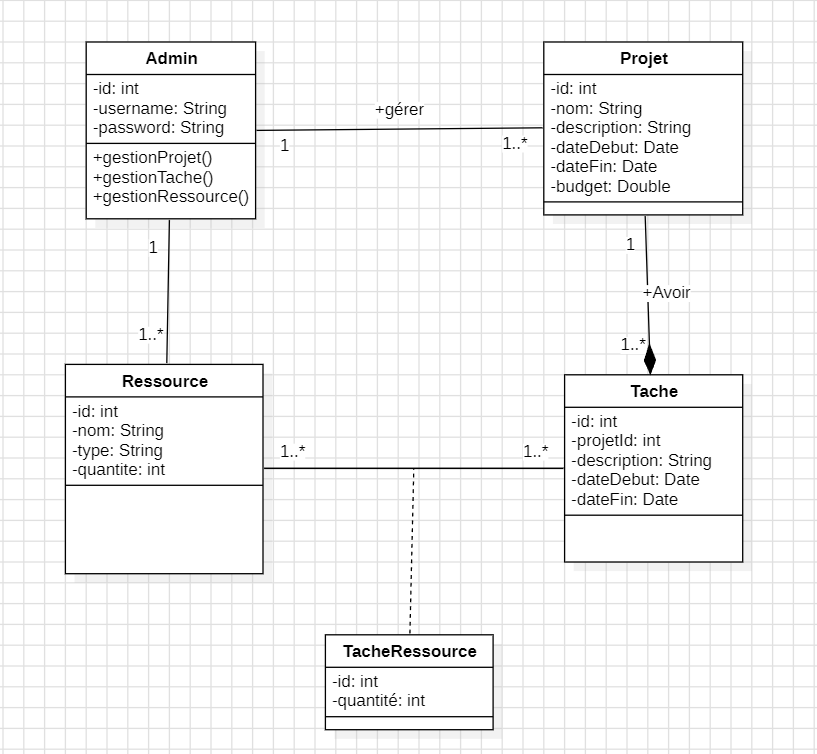
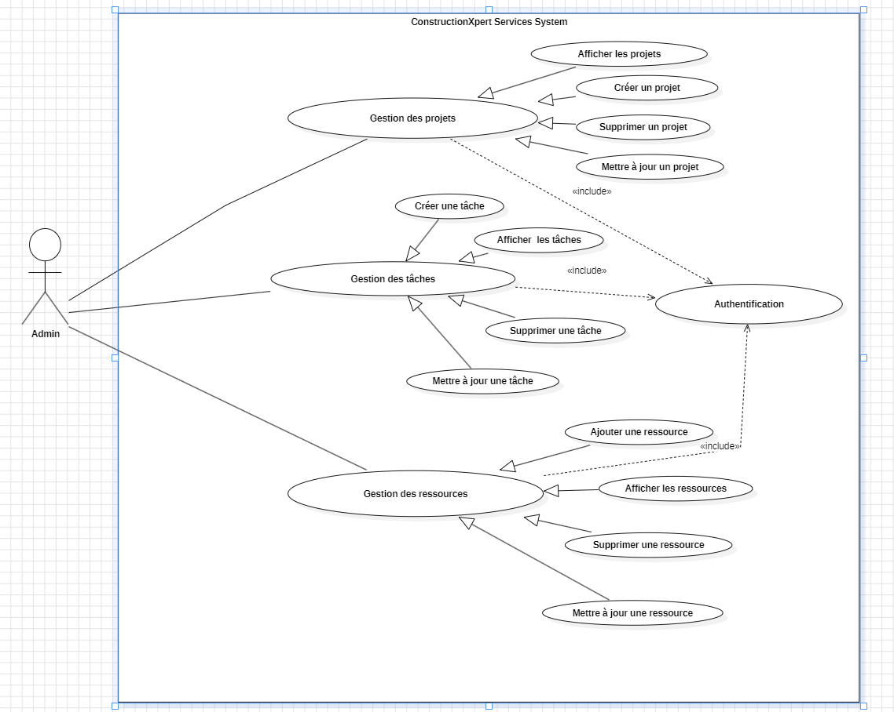

# ConstructionXpert Services 🚧🚀✨

## Description ✨🚀🚧
ConstructionXpert Services est une application web de gestion de projets de construction. Elle permet aux utilisateurs de créer, gérer et visualiser les projets de construction, les tâches associées et les ressources nécessaires. Cette solution offre une interface conviviale pour visualiser, mettre à jour et supprimer des projets tout en assurant une gestion efficace des ressources.

## Fonctionnalités 🚀✨🚧

### Gestion des Projets
- Création d'un nouveau projet avec nom, description, date de début, date de fin et budget.
- Affichage de la liste des projets existants avec leurs détails.
- Mise à jour des détails d'un projet existant.
- Suppression d'un projet.

### Gestion des Tâches
- Création de nouvelles tâches pour un projet avec description, date de début, date de fin et ressources nécessaires.
- Affichage de la liste des tâches associées à un projet.
- Mise à jour des détails d'une tâche.
- Suppression d'une tâche.

### Gestion des Ressources
- Ajout de nouvelles ressources avec nom, type, quantité et informations sur le fournisseur.
- Affichage de la liste des ressources disponibles.
- Mise à jour des détails d'une ressource.
- Suppression d'une ressource.
- Mise à jour automatique de la quantité après assignation à une tâche.

### Fonctionnalités Supplémentaires
- Connexion et déconnexion de l'administrateur.
- Sécurisation des pages accessibles uniquement après connexion.
- Gestion des fournisseurs.

## Conception 🚧✨🚀

### Diagrammes UML
- **Diagramme de Classes**
- 

- **Diagramme de Cas d'Utilisation**
- 

- **Diagramme de Séquence**
-

## Technologies et Outils Utilisés 🚀🚧✨
- **Langage de Programmation** : Java
- **Framework Web** : Java EE (Servlets, JSP)
- **Base de Données** : MySQL/PostgreSQL
- **JDBC API** : Pour la communication entre l'application et la base de données
- **Serveur d'Application** : Apache Tomcat
- **Frontend** : HTML, CSS (Bootstrap/Tailwind), JavaScript
- **Maquette** : Figma/Adobe XD
- **Gestion de Versions** : Git

## Modalités Pédagogiques ✨🚧🚀
- **Travail** : Individuel
- **Durée de Travail** : 5 jours
- **Date de Lancement** : 17/03/2025 à 09:00
- **Date Limite de Soumission** : 21/03/2025 avant 16h00

## Comment Utiliser l'Application 🚧🚀✨
1. Connectez-vous en tant qu'administrateur pour accéder aux fonctionnalités.
2. Créez un nouveau projet en fournissant tous les détails nécessaires.
3. Ajoutez des tâches associées avec leurs dates et ressources.
4. Gérez les ressources en les ajoutant, modifiant ou supprimant selon les besoins.
5. Consultez et mettez à jour les détails de vos projets, tâches et ressources.
6. Déconnectez-vous une fois le travail terminé pour sécuriser vos données.

## Livrables 🚀✨🚧
- Lien de la planification des tâches (Trello, etc.).
- Support de présentation.
- Lien de la maquette Figma.
- Lien vers le repository GitHub contenant :
  - **README** (description de l'application).
  - **Diagrammes UML** (Classes, Cas d'Utilisation, Séquence).
  - **Code source complet** avec tous les fichiers nécessaires.

## Critères de Performance ✨🚧🚀
- Fonctionnalités complètes et fonctionnelles conformes aux spécifications.
- Interface utilisateur conviviale et responsive.
- Code bien structuré suivant l'architecture MVC et les bonnes pratiques.
- Respect des délais de livraison.
